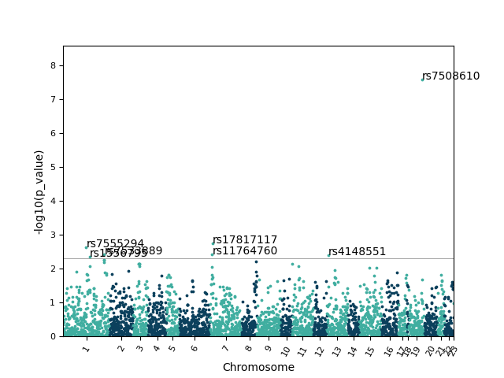

# Manhattan Plot Generator
This tool returns a report and a plot from the results of Genome-Wide Association (GWA) studies. It reads text files (`.csv`, `.txt`) that must include columns for a chromosome, p-values, and, optionally, reference SNP ID. This tool is based on the Manhattan plot tool developed by “Pudkip.” See repository: `https://github.com/Pudkip/Pyhattan`.


__Input:__

A text file with chromosome number columns, p-value, and optionally, the reference SNP ID. As input other parameters are requested: significance level (0.05 as default)


__Output:__

A report with the significant IDs related to strongly associated loci and a plot.

#### Example 

__Input:__

```
,chromosome,refSNP,p_value
1,1,rs1802353,0.42055101
2,1,rs1803213,0.620000
3,2,rs111113,0.20321103
4,2,rs1242353,0.220503
5,3,rs65421,0.4506697
6,4,rs55411,0.35097
7,5,rs254201,0.250632
8,6,rs655501,0.1506697
9,6,rs6297744,0.1560808
10,7,rs1697244,0.1760201
(...)
```
Significance level = 0.005

__Output:__

```
GWA STUDY
DATE	07/02/2020 13:35:34
FILE	    China_Pharm.txt
DS	RefSNPs with p-value < 0.005 translate to strong associated loci.

ID	rs7555294	 NCBI SNP entry: https://www.ncbi.nlm.nih.gov/snp/?term=rs7555294
ID	rs1556795	 NCBI SNP entry: https://www.ncbi.nlm.nih.gov/snp/?term=rs1556795
ID	rs7533889	 NCBI SNP entry: https://www.ncbi.nlm.nih.gov/snp/?term=rs7533889
ID	rs12192544	 NCBI SNP entry: https://www.ncbi.nlm.nih.gov/snp/?term=rs12192544
ID	rs11764760	 NCBI SNP entry: https://www.ncbi.nlm.nih.gov/snp/?term=rs11764760
ID	rs7812159	 NCBI SNP entry: https://www.ncbi.nlm.nih.gov/snp/?term=rs7812159
ID	rs17817117	 NCBI SNP entry: https://www.ncbi.nlm.nih.gov/snp/?term=rs17817117
ID	rs4148551	 NCBI SNP entry: https://www.ncbi.nlm.nih.gov/snp/?term=rs4148551
ID	rs7508610	 NCBI SNP entry: https://www.ncbi.nlm.nih.gov/snp/?term=rs7508610
\\ 
```


